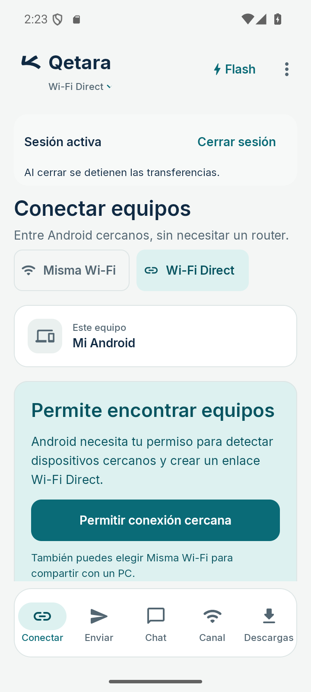
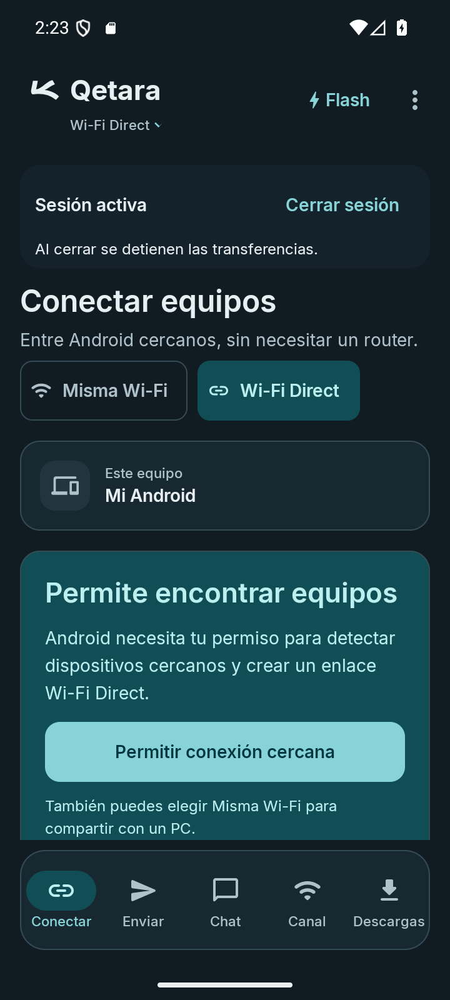

# Qetara · Aleph sin fondo en ambos temas

El aleph y el nombre comparten `onBackground`: azul `#102A43` en claro y blanco suave `#E7EFF2` en oscuro. Se elimina por completo la base del símbolo. Su forma, proporción, viewport de 40 × 40 dp y alineación se conservan.

La adaptación se aplica sólo al dibujo de la cabecera mediante `ColorFilter.tint`. El recurso original del launcher sigue intacto, con su trazo y escala originales.

| Claro | Oscuro |
| --- | --- |
|  |  |

## Comprobación

APK final compilado e instalado en emulador Android 16/API 36. Las dos capturas se inspeccionaron a 360 × 800 dp, texto 100 %. Se verificó el cambio de tema y la ausencia del recuadro. Compilación y lint correctos, con 0 errores y las dos advertencias preexistentes (`UsableSpace`, `UseKtx`). `git diff --check` correcto. No se repitieron pruebas JVM para este ajuste visual.

Contraste sRGB del aleph y el nombre sobre la cabecera: **13.49:1** en claro y **15.0:1** en oscuro. Esta medición no certifica la accesibilidad de toda la aplicación.

APK debug: `app/build/outputs/apk/debug/app-debug.apk`, 22,982,982 bytes.

```text
SHA-256 2a8817499f589ed0030ed4443a6e9fb8f359d3fabacf4a8f0fb0c0dda02fd1ef
```

[Manifiesto](manifest.json) · [Referencia móvil](../MOBILE.md) · [Revisión anterior](../mobile-brand-review/README.md).

Figma MCP continúa limitado por cuota; la referencia queda local. Esta revisión abarca únicamente la presentación de la marca y no incluye teléfono físico ni transferencias.
