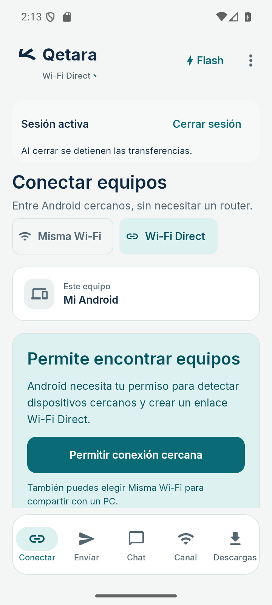
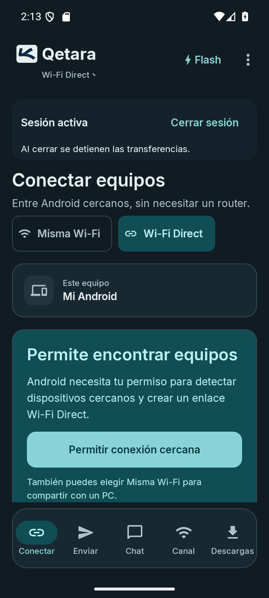

# Qetara móvil · Marca integrada

> Revisión histórica: las pruebas, hashes y capturas de este documento corresponden
> a la variante con símbolo azul y base clara en oscuro. La variante posterior
> elimina la base en ambos temas y adapta únicamente la tinta de la cabecera
> mediante `onBackground`, preservando el vector original. Su compilación, lint y
> capturas verificadas se documentan en la [revisión de marca adaptable](../mobile-brand-adaptive/README.md).

Aleph y nombre forman una misma fila, alineados verticalmente. Se eliminó el margen adicional de 10 dp entre ambos; el espacio propio del vector conserva la separación. El modo de conexión queda debajo del nombre y mantiene su selector.

En claro, el símbolo aparece directamente sobre el fondo. En oscuro, una base clara de 28 × 24 dp preserva la legibilidad del azul, con radio de 4 dp y sin borde, sombra ni interacción propia. El símbolo conserva su trazo, color y proporción originales; el viewport de la imagen permanece en 40 × 40 dp. El launcher y el splash no cambian.

| Claro | Oscuro |
| --- | --- |
|  |  |

[Cabecera con texto al 200 %](large-type-dark.png) · [Selector de conexión abierto](mode-menu.png) · [Manifiesto](manifest.json) · [Referencia móvil](../MOBILE.md).

## Validación

- Compilación final `:app:assembleDebug :app:lintDebug --offline --console=plain`: correcta. Lint: 0 errores y las dos advertencias preexistentes (`UsableSpace`, `UseKtx`).
- `git diff --check`: correcto. Recurso `ic_launcher_foreground.xml` idéntico a HEAD; azul `#102A43`, viewport 108 × 108 y escala uniforme `0.65625` intactos.
- Emulador Android 16: cabecera en claro y oscuro a 360 × 800 dp y texto 100 %; cabecera compacta a 320 × 640 dp y texto 200 %, con nombre, modo, Flash y opciones visibles.
- El selector abre las tres opciones («Wi‑Fi Direct», «Wi‑Fi LAN», «Completo») y se cierra con Atrás. Su callback se conserva.
- Contraste del azul del símbolo con su fondo: 13,49:1 en claro y 12,57:1 en oscuro, calculado sobre colores sRGB opacos.

APK **debug** local: `app/build/outputs/apk/debug/app-debug.apk`, 22,982,982 bytes.

```text
SHA-256 4ff1235c6d22a0b7eccda4c8d8d90ba182766e4c900fcdf8f27529a00ba35ff2
```

No se repitieron pruebas JVM ni transferencias: esta iteración modifica únicamente la presentación de la marca y la altura necesaria para alojarla. Las capturas corresponden al APK indicado; no acreditan todas las pantallas ni una revisión completa de accesibilidad.

Figma MCP continúa limitado por cuota; la referencia y las capturas quedan locales. La primera captura del arranque devolvió un árbol de interfaz vacío y se repitió cuando la aplicación estuvo lista. No se usó un teléfono físico.
