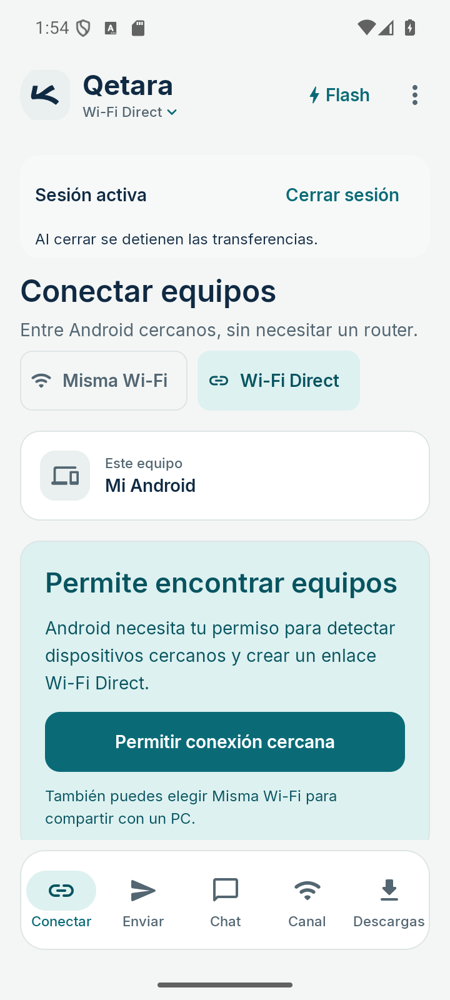
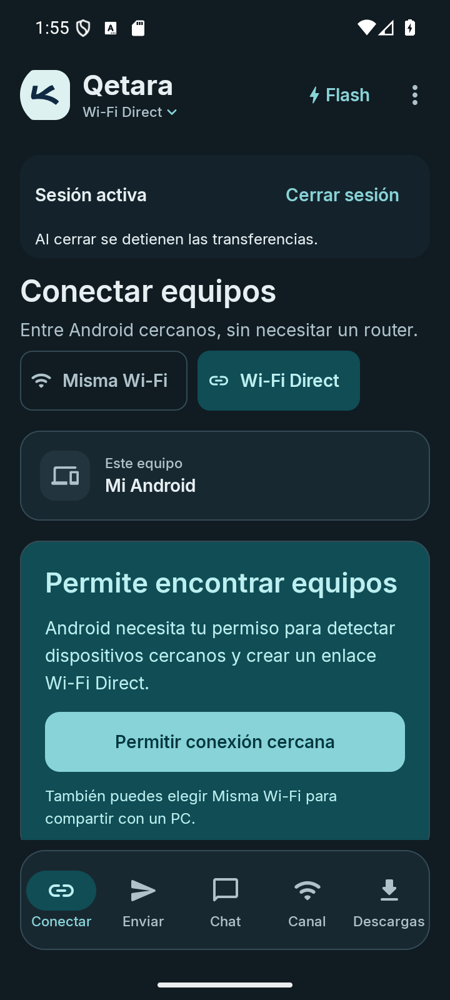
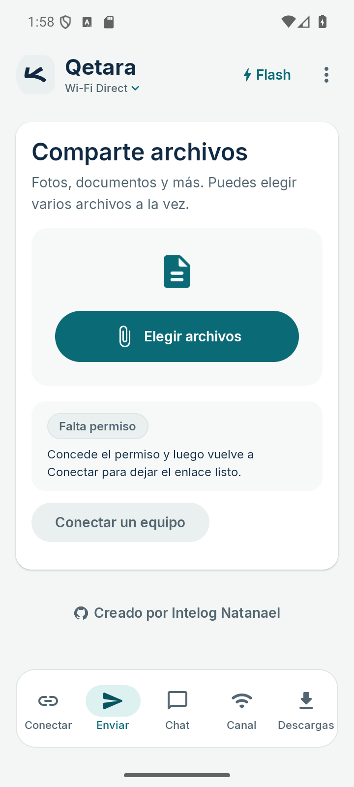
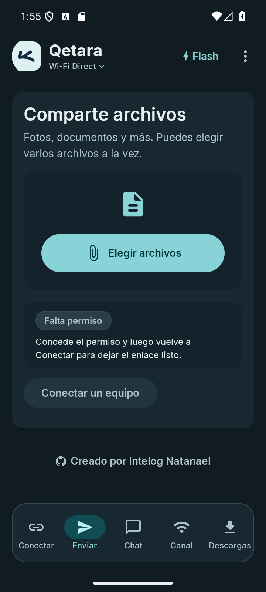
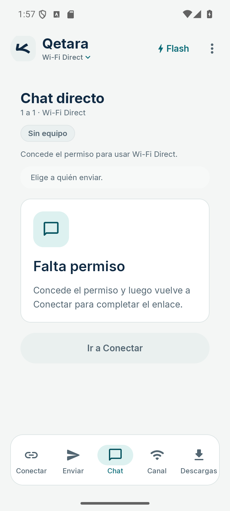
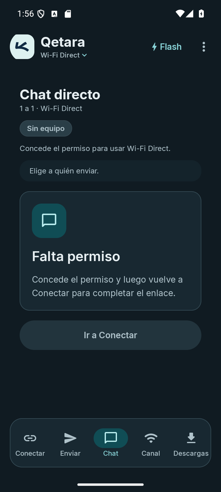
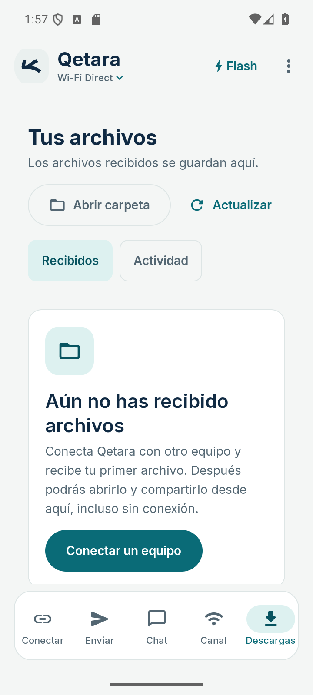
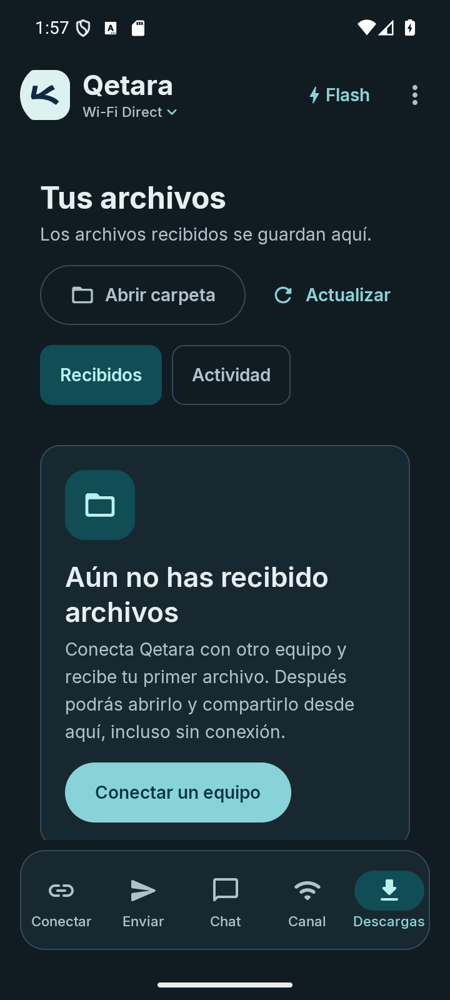
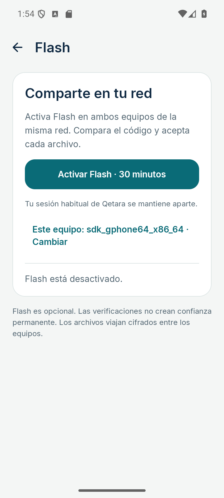
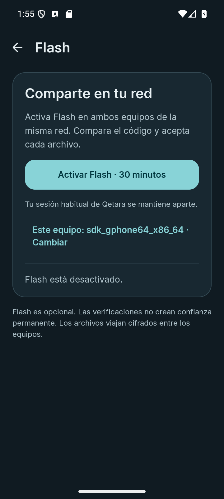

# Qetara móvil · Colores claros y oscuros

Capturas reales del APK debug de la revisión cromática. Mismo símbolo y proporción en ambos temas.

[Alcance y validación](../../../docs/MOBILE_COLOR_REVIEW-2026-09-11.md) · [Colores y reglas](../MOBILE.md) · [Manifiesto](manifest.json)

| Pantalla | Claro | Oscuro |
| --- | --- | --- |
| Conectar |  |  |
| Enviar |  |  |
| Chat |  |  |
| Descargas |  |  |
| Flash |  |  |
