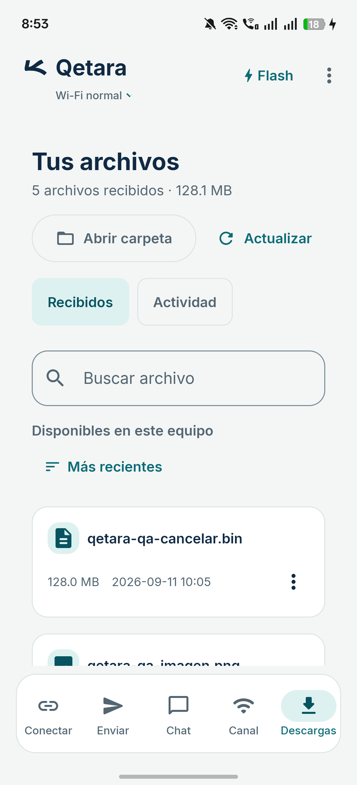
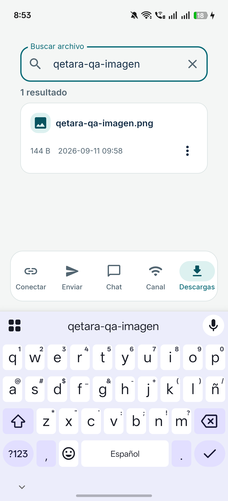
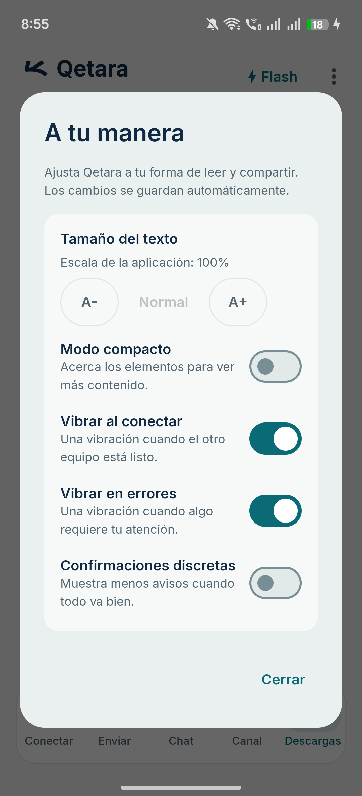
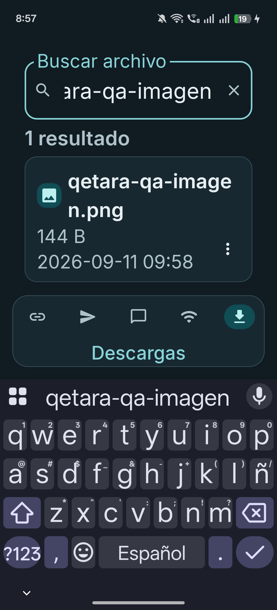

# GUI móvil en teléfono físico — 12 de septiembre de 2026

Capturas originales, sin recortar ni alterar, del APK de revisión instalado en Android 16/API 36: pantalla de 1080 × 2372 px y ancho lógico de 360 dp. Los archivos visibles son muestras sintéticas. El [informe](../../../docs/MOBILE_PHYSICAL_REVIEW-2026-09-12.md) detalla el recorrido y sus límites; [manifest.json](manifest.json) conserva los hashes de imágenes, APK y fuentes.

Estas imágenes son evidencia de Android. Figma devolvió una página vacía en la consulta inicial y después limitó las llamadas MCP; no se afirma una revisión completada en Figma.

## Biblioteca, tema claro, texto al 100 %

El nombre completo ocupa una fila; el tamaño, la fecha y el menú tienen espacio propio.

## Búsqueda, tema claro, texto al 100 %

Mientras se escribe, los controles secundarios dejan espacio al resultado. Reaparecen al cerrar el teclado.

## Preferencias, tema claro, texto al 100 %

Los tres controles de tamaño de texto caben en una fila y conservan una altura táctil mínima de 48 dp.

## Búsqueda, tema oscuro, texto del sistema al 200 %

El nombre se distribuye en dos líneas y la fecha ocupa una línea completa. El resultado y su menú siguen visibles sobre el teclado. La escala propia de Qetara permanece al 100 %.

