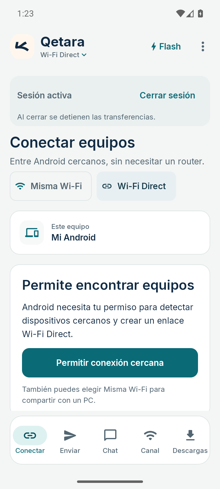
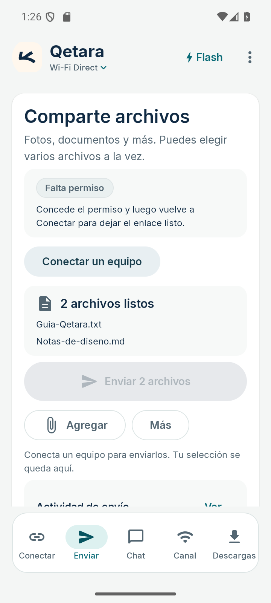
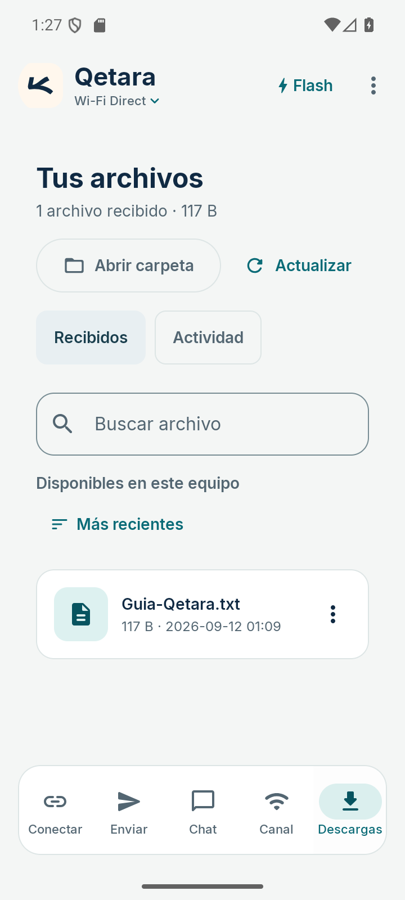
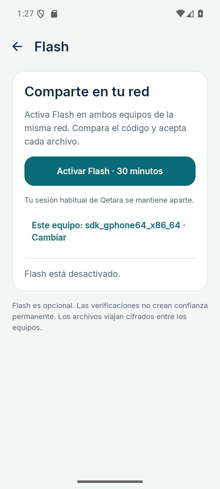
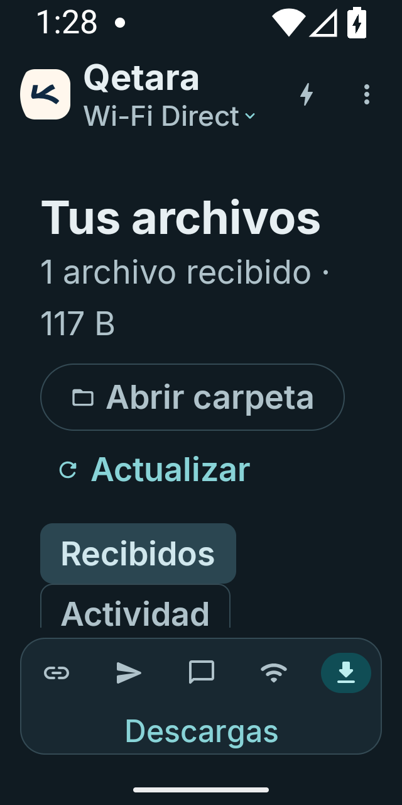

# Qetara · Capturas de la GUI móvil

Capturas reales del APK de revisión en un emulador Android 16. Los archivos son muestras sintéticas. Esta galería local no es una maqueta editable de Figma.

[Validación y límites](../../../docs/MOBILE_DESIGN_REVIEW-2026-09-11.md) · [Tokens](../mobile-tokens.json)

## Conectar · 360 × 800 dp · claro

## Dos archivos seleccionados · 360 × 800 dp · claro

## Biblioteca con archivo sintético · 360 × 800 dp · claro

## Flash desactivado · 360 × 800 dp · claro

## Biblioteca · 320 × 640 dp · texto al 200 % · oscuro

