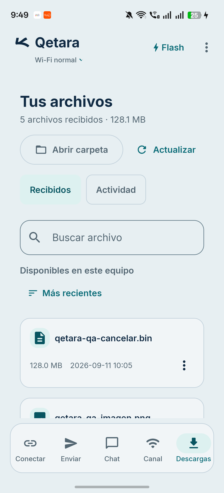
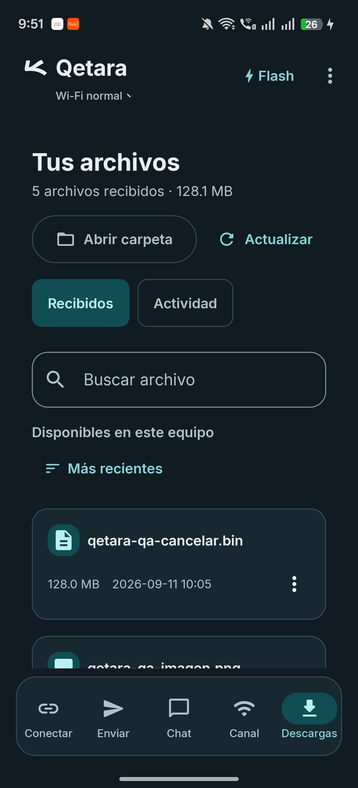
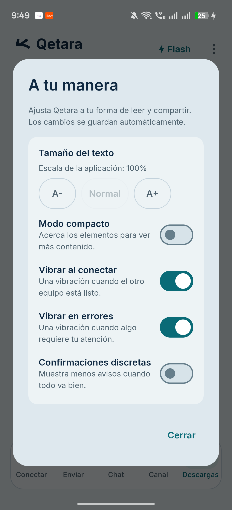

# Superficies y marca Android — 12 de septiembre de 2026

El modo claro, el fondo del icono Android y el arranque comparten ahora la misma familia gris azulada. Las tarjetas mantienen una luminosidad ligeramente mayor para conservar la jerarquía. La tinta azul oscuro del aleph coincide con el nombre y los títulos; las acciones conservan el turquesa.

[Abrir comparación interactiva](comparison.html) · [Contrastes calculados](contrast.json) · [Procedencia de archivos](manifest.json)

## Cambio aplicado

| Elemento | Antes | Ahora |
| --- | --- | --- |
| Fondo claro | `#F4F6F5` | `#E7EFF2` |
| Tarjetas y navegación | Blanco `#FFFFFF` | `#F1F5F7` |
| Fondo del icono Android | Marfil `#FFF7ED` | `#E7EFF2` |
| Aleph original | Azul `#102A43` | Mismo recurso, tinta y geometría |
| Cabecera | Tinta adaptada, sin base propia | Se conserva |
| Arranque | Marfil en ambos temas | Fondo e imagen adaptados al tema |

Las superficies neutras claras dejan de usar blanco puro. El blanco continúa en textos sobre botones oscuros y otros roles de contenido donde aporta contraste. El bloque de colores oscuros de Compose es idéntico al commit base.

`ic_launcher_foreground.xml` conserva bytes, path, viewport 108 × 108, pivote y escala uniforme 0,65625. Se regeneraron los diez iconos WEBP de Android desde ese recurso. La nueva opción `--android-only` del generador evita modificar los iconos de escritorio. El splash conserva su path y escala propios; sólo cambia su referencia de color.

## Comprobación física

Se instaló una actualización firmada mediante `adb install -r` en el mismo teléfono Android 16/API 36 de 1080 × 2372 px, ancho lógico de 360 dp y escala de texto al 100 %. Descargas conservó sus cinco archivos sintéticos. Se inspeccionaron:

- Conectar, Enviar, Chat vacío, Canal antes de entrar y Descargas en claro.
- Menú de opciones, preferencias y Flash desactivado en claro.
- Descargas y su cabecera en oscuro.
- El icono instalado, mostrado por Android en Información de la aplicación.

En las capturas se mantiene la diferenciación de tarjetas, controles y selección. El símbolo y el nombre comparten tinta sin una baldosa detrás del aleph. La propuesta se considera más coherente por la continuidad del fondo entre icono, cabecera y superficies; esa valoración es estética, no una medida objetiva de preferencia del usuario.

Se restauró el modo oscuro original (`ui_night_mode=2`); la escala del sistema permaneció en `1.0` y la propia de la app en 100 %. No se enviaron archivos o mensajes ni se activó Flash durante este pase. Las pruebas al 200 % pertenecen al [pase anterior](../../../docs/MOBILE_PHYSICAL_REVIEW-2026-09-12.md); no se atribuyen nuevamente a este APK. El arranque nuevo se compiló y sus recursos día/noche se contrastaron con el tema, pero no se capturó su animación transitoria.

## Compilación y contraste

`:app:assembleRelease :app:lintRelease --offline --no-daemon --max-workers=2 --console=plain` terminó correctamente: 53 tareas, 21 ejecutadas. Lint registra cero errores y las dos advertencias preexistentes `UsableSpace` y `UseKtx`. No se repitieron las suites unitarias, ya que este pase modifica colores y recursos gráficos.

El cálculo de luminancia sRGB cubre 112 pares opacos de roles de color. El mínimo de los pares de texto activo comprobados es **4,57:1 en claro** y **5,05:1 en oscuro**; los contornos evaluados superan **3,26:1**. El [JSON](contrast.json) enumera cada par y la fórmula. No incluye transparencias de estados deshabilitados, superposiciones, imágenes, todos los componentes del sistema ni una auditoría integral de accesibilidad.

APK de prueba: `io.github.intelognatanael.qetara`, versión 1.4.0/código 7, 14.856.229 bytes. Compilación del árbol de trabajo basada en `f556bf865d534e22ef5c78c07abeafa8f72f395a`, firmada con el certificado existente; no constituye una candidata reproducible desde ese commit sin los cambios posteriores.

La copia del APK extraída del teléfono al terminar coincide con el archivo firmado usado para la actualización. SHA-256 del APK instalado:

```text
e002d3f0962f0ad8c0aa1bcc8e528b2a5c5a6e60e698a801e5ade4245f9b361b
```

El comparador usa la captura anterior del APK `021afa4b…` de la [galería física previa](../mobile-physical-review/README.md) y las capturas nuevas de este APK. Las PNG se conservan sin edición. Las ilustraciones SVG del icono se identifican por separado: muestran el mismo vector con dos fondos y no son capturas del launcher.

Figma MCP volvió a rechazar la consulta por la cuota del plan Starter. No se realizó una revisión ni sincronización remota; la referencia queda en esta galería, el comparador y [mobile-tokens.json](../mobile-tokens.json).

## Capturas







Las otras vistas claras conservadas son [Enviar](send-light.png), [Chat](chat-light.png) y [Canal](channel-light.png). Conectar, Flash e Información de la aplicación permanecen en la evidencia local ignorada por Git.
